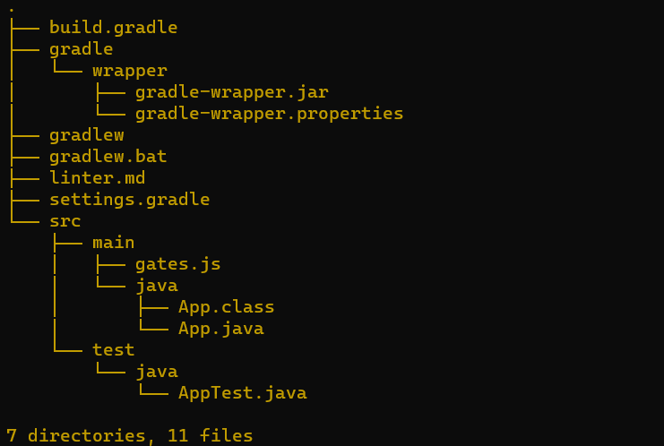

# java-fundamentals

## Lab-01 : 

 

 

## Lab-02 : 

## Lab-03

## Table Of Content : 

| Directory  | Link                                 |
|------------|--------------------------------------|
|basics      | [LINK](basics/basics.md)             |
|basiclibrary| [LINK](basiclibrary/basiclibrary.md) |
|linter      | [LINK](linter/linter.md)             |
